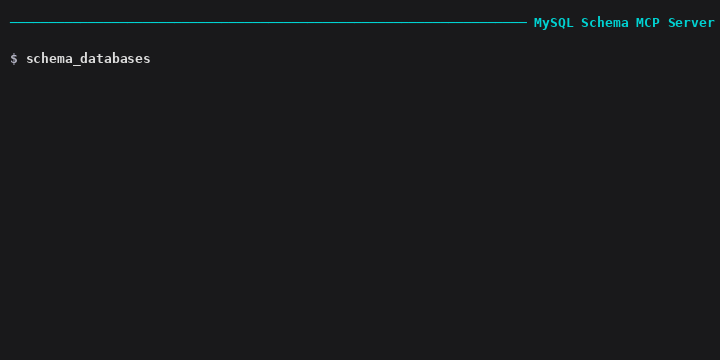

# mcp-server-mysql-schema

[](https://www.npmjs.com/package/mcp-server-mysql-schema)
[](LICENSE)
[](package.json)
[](https://github.com/rendi-febrian/mcp-server-mysql-schema/actions/workflows/ci.yml)
[](https://github.com/rendi-febrian/mcp-server-mysql-schema)

<div align="center">
  
  <br>
  <em>Explore tables, columns, FKs, indexes via MCP</em>
</div>

MySQL Schema MCP Server — explore tables, columns, foreign keys, indexes, and relationships through the [Model Context Protocol](https://modelcontextprotocol.io). Works with opencode, Claude Desktop, Cursor, and any MCP-compatible AI client.

No more writing `SHOW TABLES` and `DESCRIBE` manually. Ask your AI assistant "what tables are in this database?", "show me the foreign keys of the orders table", or "find all columns named 'status'" — and get structured JSON responses.

---

## Quick Start

```bash
# Install
npx mcp-server-mysql-schema

# Or clone
git clone git@github.com:rendi-febrian/mcp-server-mysql-schema.git
cd mcp-server-mysql-schema
npm install && npm run build
```

### opencode Configuration

```json
{
  "mcp": {
    "mysql-schema": {
      "type": "local",
      "command": ["node", "/path/to/mcp-server-mysql-schema/dist/index.js"],
      "environment": {
        "MYSQL_HOST": "127.0.0.1",
        "MYSQL_PORT": "3306",
        "MYSQL_USER": "root",
        "MYSQL_PASS": "your-password"
      },
      "enabled": true
    }
  }
}
```

### Claude Desktop / Cursor / Other MCP Clients

```json
{
  "mcpServers": {
    "mysql-schema": {
      "command": "node",
      "args": ["/path/to/mcp-server-mysql-schema/dist/index.js"],
      "env": {
        "MYSQL_HOST": "127.0.0.1",
        "MYSQL_PORT": "3306",
        "MYSQL_USER": "root",
        "MYSQL_PASS": "your-password"
      }
    }
  }
}
```

## Features

### Tools

| Tool | Description | Example |
|---|---|---|
| `schema_databases` | List all non-system databases with charset | `schema_databases()` |
| `schema_tables` | All tables — engine, row count, auto-increment, comments | `schema_tables(database: "myapp")` |
| `schema_views` | All views in a database | `schema_views(database: "myapp")` |
| `schema_table_detail` | Columns: type, nullable, default, key, extra, comment | `schema_table_detail(database: "myapp", table: "users")` |
| `schema_foreign_keys` | FK relationships — all DB, per-table, incoming/outgoing | `schema_foreign_keys(database: "myapp", table: "orders")` |
| `schema_indexes` | Indexes: name, columns, seq, unique, type, comment | `schema_indexes(database: "myapp", table: "users")` |
| `schema_relationships` | Full PK/FK map across all tables | `schema_relationships(database: "myapp")` |
| `schema_search` | Search table and column names by keyword | `schema_search(database: "myapp", keyword: "user")` |

### Resources

| URI | Content |
|---|---|
| `schema://{db}/tables` | All tables in the database |
| `schema://{db}/relationships` | Full relationship map |
| `schema://{db}/{table}/columns` | Column details |
| `schema://{db}/{table}/indexes` | Index details |
| `schema://{db}/{table}/foreign-keys` | Foreign key details |

### Security

**100% read-only.** Every query targets `information_schema` only. No `SELECT` on user tables. No `INSERT`, `UPDATE`, `DELETE`, or `DDL`. The server cannot modify any data.

## Why Not Just Use MySQL MCP?

| | MySQL MCP | Schema MCP (this) |
|---|---|---|
| **Purpose** | Run arbitrary SQL | Introspect database structure |
| **Query target** | Any table / any query | `information_schema` only |
| **Write access** | Optional (configurable) | Never |
| **Structured tools** | Single `mysql_query` tool | 8 focused tools |
| **Resources** | Table-level | Table + FK + relationship maps |
| **Best for** | Data CRUD, ad-hoc queries | Schema discovery, ERD, migrations |

## Requirements

- **Node.js** >= 18
- **MySQL** 5.7+ or MariaDB 10.2+
- MySQL user with `SELECT` on `information_schema` (default)

## Environment Variables

| Variable | Required | Default | Description |
|---|---|---|---|
| `MYSQL_HOST` | No | `127.0.0.1` | MySQL host |
| `MYSQL_PORT` | No | `3306` | MySQL port |
| `MYSQL_USER` | No | `root` | MySQL user |
| `MYSQL_PASS` | No | `""` | MySQL password |
| `MYSQL_DEFAULT_DB` | No | — | Default database for resource URIs |

## Architecture

```
src/
├── index.ts              # MCP server entry point (raw Server)
├── db.ts                 # MySQL connection pool
├── schema.ts             # information_schema queries
├── tools/
│   ├── tables.ts         # schema_databases, schema_tables, schema_views
│   ├── detail.ts         # schema_table_detail
│   ├── foreignKeys.ts    # schema_foreign_keys
│   ├── indexes.ts        # schema_indexes
│   ├── relationships.ts  # schema_relationships
│   └── search.ts         # schema_search
└── resources/
    └── index.ts          # schema:// URIs
```

No ORM, no migrations, no configuration files — just raw `information_schema` queries over `mysql2`.

## Contributing

See [CONTRIBUTING.md](CONTRIBUTING.md).

## License

[MIT](LICENSE)
